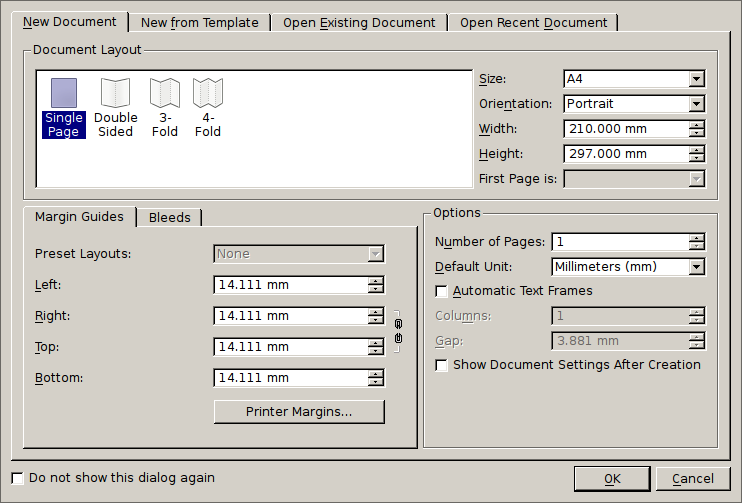
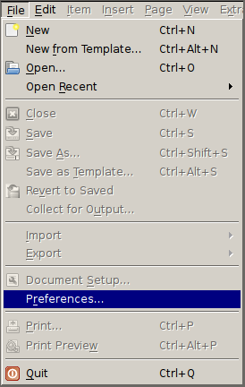
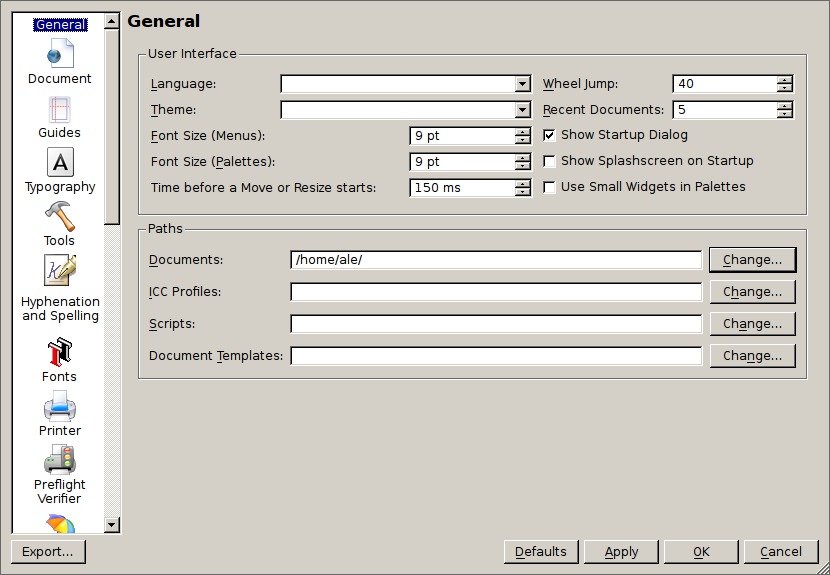
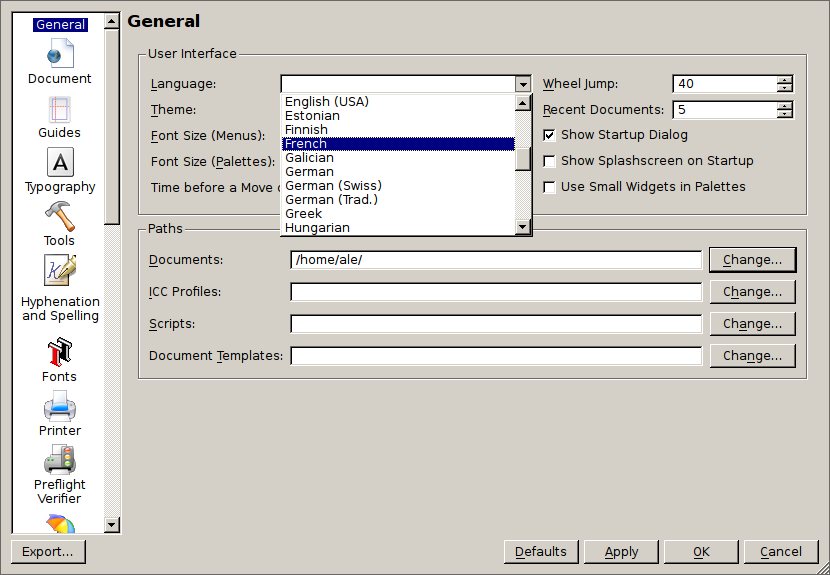
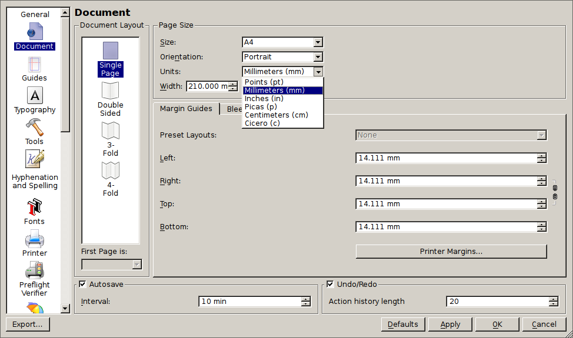

# Tweak some basic preferences

In this chapter we will suggest a few changes to the settings that make Scribus better angepasst to  what is commonly used in your place and language.

After having started Scribus, you will see the following dialog:

If you have already closed it, don't worry: our next step is to close it by pressing `Ok` or `Cancel`. We don't need a document to be open so you can press any of both.

## The preferences dialog

Now, you're ready to open the preferences dialog from the file `File` menu:

The Preferences dialog defines the settings Scribus will use for all future documents (not the one currently open, if any). On top of it, it contains settings that that do not relate to specific documents (like the user interface language).  
It's worth to mention that there are a few settings that can only be changed if no document is open (like the list the directories containing your fonts).

The preferences are divided in sections. You have a list of them on the left side of the dialog. The "General" section is the one being automatically activated.

## Choose the UI language

The default language for Scribus is English. Depending the way Scribus has been installed its default language might be the one of your operating system.

If your not comfortable with the language Scribus is currently using for its user interface it's time to choose the one you prefer:

Most of the translations are up to date and complete. If some parts are not translated, they text will be shown in English.

If you find errors or missing translations, don't hesitate to get in touch with the Scribus developers (see the [Getting in touch]() chapter towards the end of this handbook).

## Define the measurement unit

Scribus provides all six units that are in use in the printing world. Pick the one you need!

If you're not sure which one you should choose, here are three general rules:

- If you're in Continental Europe or in the "rest of the world" choose `Millimeters (mm)`
- If you're in the US, UK or you're a Canadian used to the imperial measurement use `Inches (in)`

Three things are worth being mentioned:

- Some measurement are always shown in points (like the font size).
- You can use any of the units in any field that expects one and it will be automatically converted to the default one you have selected (you can type `2 cm` in a field that says `10 mm` and it will automatically be converted to `20 mm`)
- We suggest to use Millimeters rather than Centimeters: sometimes you will need a higher precision than a millimeter: you don't want to type or see `0.005 cm` for half a millimeter!  
  TODO: add an animated gif showing it

## Choose the correct default page size

Scribus provides lot of page formats you can choose from when creating a document.

As the default value, you want to choose the one you will be using the most:

- If you're in Continental Europe or in the "rest of the world" it's very likely that you want `A4`
- If you're in the US, UK or Canada you will probably use the `Letter` format.

## Pick a list of page sizes

TODO: In Scribus 1.6 the list of page sizes shown by default is reduced to a minimum. This section will be removed from the 1.4 branch as soon it gets created and only left in the master branch.

While Scribus knows about lot of different page sizes, only few are shown by default in the list. Depending on the habits of your local print industry, you will want to add a few more:

- If you're in Continental Europe or in the "rest of the world" you will probably want to add:
  - A5,
  - A6,
  - A3,
  - and A1 and A2 if you plan to create big posters.
- If you're in the US, UK or Canada you can add:
  - TBC

You don't have to add all the formats you could possibly want to use in the future, just the you're likely to use: you can always come back to the preferences and add further formats!
