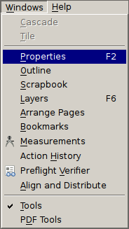
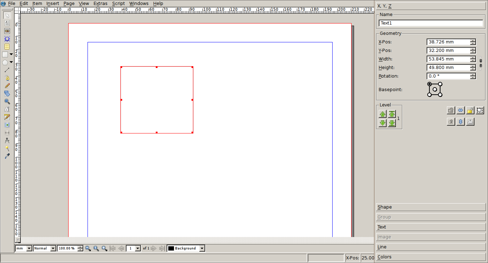

# Cleanup the user interface

One of the feedbacks we often get from new users is that the Scribus user interface is too busy and that some of the functionality is not easy to discover.

Scribus is a powerful tool that gives you precise control on the way your text and images are layouted. There is a complexity that transpires in the user interface: there will be many buttons, input boxes, dialogs filling your screen to get the work done.

This chapter gives hints for reducing the number of unused (or rarely used) elements and define a good setup for some of the most important tools.

With only a few changes, it's possible to largely improve the user interface and help you better focus on your work.

## Maximize the application window

It's good practice to maximize the Scribus window (except if you have a very large monitor).

TODO: we need screenshots of the maximize button for KDE, Gnome, OS X and Windows.

One the one side, having only one window helps you to focus on your work and, on the other side, reducing the number of graphical elements on your monitor will help you noticing and finding the relevant ones.

## Place the properties palette

As soon as you will start working with Scribus, you will notice that its core is the "Propreties palette". You can find it under `Window > Properties`.

It's a good idea to always have this palette at the same place and keeping it as big as possible. We suggest you to move it to the top right side of your main Scribus window monitor and resize it so that it vertically matches the height of the window.

TODO: add an animated gif showing how to display, move to the right, resize and hide the properties palette.

You should not place the properties palette to the right of the main Scribus window, but on top of it, at its right side. While it's displayed, the palette will cover parts of your work, but will give you the full width when it's hidden.

As you can see next to the `Windows > Properties` menu entry, you can use the `F2` function key to show and hide the Properties palette.

TODO: for 1.6 explain how to dock the palette instead of placing it on top of the right side of the window.

## Hide and show the palettes

As we have just seen for the Properties palette, it's "ratsam" to only keep the Scribus open dialog open for the time they are strictly needed.

Some other important dialogs that you're also likely to use in a very intensive way for a short time and then won't need during the next task are:

- the style manager (`Edit > Styles...`, F3)
- align and distribute (`Windows > Align and Distribute`)
- scrapbook (`Windows > Scrapbook`)
- layers (`Windows > Layers`, `F6`)
 
Try as much as possible to avoid keeping moving the windows around: put them in a place that is comfortable to you and always have them at the same place: it will help you being faster and less stressed when using them.
If they are in your way change the displayed are of the document and close the dialogs that you not need at this very moment.

When they are available, you should learn the shortcuts. You can find them in the `Edit` or `Window` menu, next to the name of the dialog.

## Hide most toolbars but the tools one

Many programs offer standard toolbars for opening files, copy pasting, printing and various other tasks. They can be cute and handy at some time, but they also clutter your desktop with distracting icons and reduce the place available for your own work.

By default, Scribus shows all the available toolbars. We suggest you to hide all of them but the "Tools" toolbar.

For hiding a toolbar, right click on any of the toolbars and in the context menu that pops up disable the `✓` check mark next to it.

TODO: add an animated gif showing how to hide a toolbar.

All the actions that you can find in the toolbars, are also to find in the menus and the most used one can be triggered through keyboard shortcuts: after a short time you won't miss them anymore.

TODO: add a link to a chapter in another manual, listing all the most important shortcuts.

## Move the tools toolbar to the left

Having reduced the number of toolbars, we finally want optimize the size of the workspace.

Nowadays, most monitors are wider than they are taller: in order to save a little bit of vertical space, we will dock the remaining "Tools" toolbar to the left side of the Scribus main window:

TODO: add an animated gif showing how to move the toolbar to the side.
